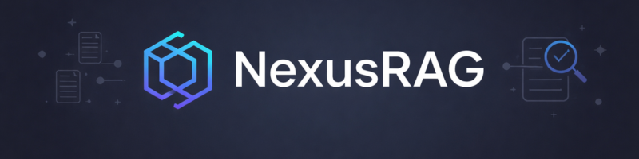
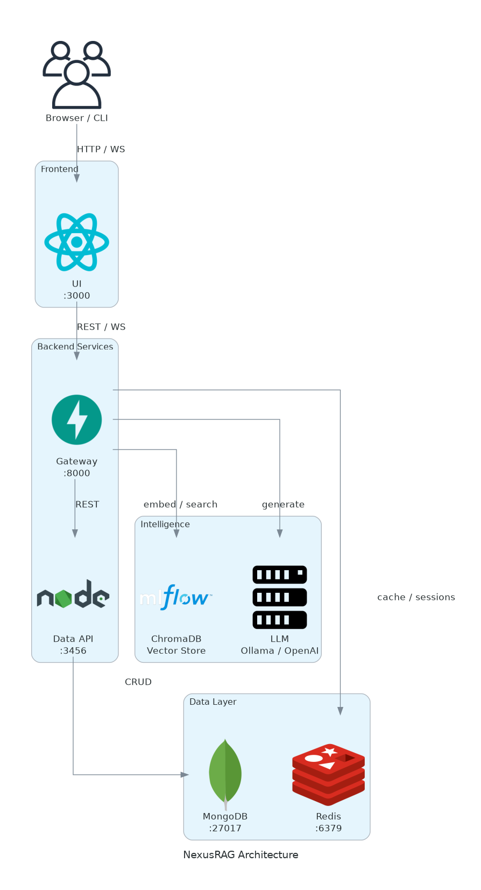

<p align="center"></p>
<!-- TODO: create banner and save as assets/banner.png -->

<h1 align="center">NexusRAG</h1>
<p align="center">Self-hosted Retrieval-Augmented Generation platform with multi-strategy retrieval, agentic orchestration, and an OpenAI-compatible API.</p>

<p align="center">
  <a href="https://opensource.org/licenses/MIT"></a>
  
  
  
  
  
  
  
  
</p>

<p align="center">
  <a href="#what-it-does">What it does</a> |
  <a href="#architecture">Architecture</a> |
  <a href="#quick-start">Quick start</a> |
  <a href="#api-reference">API reference</a> |
  <a href="#configuration">Configuration</a> |
  <a href="#design-decisions">Design decisions</a> |
  <a href="#security">Security</a> |
  <a href="#known-limitations">Known limitations</a> |
  <a href="#performance-benchmarks">Benchmarks</a> |
  <a href="#local-development">Local development</a> |
  <a href="#license">License</a>
</p>

---

## What it does

NexusRAG lets you build question-answering systems over your own documents without sending data to a third-party RAG service. You point it at a corpus, choose how aggressively you want it to search, and get back answers with cited sources.

Key capabilities:

- **Four retrieval strategies** -- vector similarity, hybrid BM25+vector, multi-query expansion, and query decomposition. Switch per request; no redeployment needed.
- **Cross-encoder reranking** -- a second-pass sentence-transformer model rescores retrieved chunks before the answer is generated, improving precision without a larger retriever.
- **Agentic tool orchestration** -- the gateway can call structured Data API endpoints (team, portfolio, sectors) to enrich answers with live business data.
- **OpenAI-compatible completions endpoint** -- drop-in replacement for `POST /v1/chat/completions` so existing clients work without changes.
- **Streaming** -- WebSocket endpoint pushes typed events (`thinking`, `status`, `token`, `sources`, `done`) so UIs can render incrementally.
- **Local-first LLM** -- defaults to Ollama for fully air-gapped deployments; swap to OpenAI or Azure with one env var.

## Architecture

<p align="center">
  
</p>

Three independently deployable services sit behind a shared Docker network:

| Service | Stack | Port | Role |
|---------|-------|------|------|
| Gateway | Python / FastAPI / LangChain / ChromaDB | 8000 | RAG intelligence: retrieval, reranking, generation, agentic tools |
| Data API | Node.js / Express / Mongoose | 3456 | Structured business data (team, portfolio, sectors, engagements) |
| UI | React 18 / Vite / Material-UI | 3000 | Conversational browser interface with streaming and source viewer |

Supporting infrastructure:

| Service | Role |
|---------|------|
| MongoDB 7 | Persistent storage for conversations and business entities |
| Redis 7 | Session cache and optional distributed rate-limiting counters |
| ChromaDB | Vector store for document embeddings (persisted to disk) |
| Ollama / OpenAI | LLM inference (configurable) |

**Data flow:** Browser sends a query to the UI, which calls the Gateway over REST or WebSocket. The Gateway retrieves document chunks from ChromaDB, optionally enriches context by calling the Data API, and generates an answer via the configured LLM. The Data API is the only service that writes to MongoDB; the Gateway never touches its collections directly.

## Quick start

### Prerequisites

- Docker 24+ and Docker Compose v2
- An OpenAI API key, OR a local [Ollama](https://ollama.ai) instance with a model pulled (`ollama pull llama3`)
- 4 GB RAM minimum (embedding models + LLM)

### Run with Docker Compose

```bash
git clone https://github.com/<your-org>/nexus-rag.git
cd nexus-rag

# Set your LLM key (leave blank to use local Ollama)
echo "OPENAI_API_KEY=sk-your-key" > .env

docker compose up --build -d
```

Wait ~60 seconds for all health checks to pass (embedding models download on first start).

```bash
# Verify services are up
curl http://localhost:8000/ready   # {"status":"ready"}
curl http://localhost:3456/ping    # {"pong":true}

# Open the chat UI
xdg-open http://localhost:3000
```

### First query

```bash
curl -X POST http://localhost:8000/api/inquire \
  -H "Content-Type: application/json" \
  -d '{
    "question": "What is the go-to-market strategy for enterprise SaaS?",
    "strategy": "vector"
  }'
```

### Ingest your own documents

```bash
curl -X POST http://localhost:8000/api/ingest \
  -F "file=@my-document.pdf"
```

Supported formats: PDF, DOCX, TXT, MD.

### OpenAI-compatible endpoint

```bash
curl -X POST http://localhost:8000/api/inquire/completions \
  -H "Content-Type: application/json" \
  -d '{
    "model": "nexus-rag",
    "messages": [{"role": "user", "content": "Summarize the portfolio."}],
    "strategy": "combined"
  }'
```

## Demo

<!-- TODO: run scripts/capture-screenshots.py after starting the app (docker compose up -d), then convert the recorded video: ffmpeg -i assets/demo.webm -vf "fps=10,scale=720:-1" -loop 0 assets/demo.gif and place at assets/demo.gif -->

## API reference

Interactive docs (Swagger UI) are served by the Data API at `http://localhost:3456/api-docs`.

### Gateway -- `http://localhost:8000`

#### `POST /api/inquire`

Submit a RAG query.

```jsonc
// Request
{
  "question": "string",          // 1-2000 chars, required
  "strategy": "vector",          // "vector" | "combined" | "expanded" | "decomposed"
  "session_id": "string",        // optional, for conversation continuity
  "use_cache": true              // optional, default true
}

// Response
{
  "answer": "string",
  "sources": [
    { "content": "string", "score": 0.87, "metadata": {} }
  ],
  "strategy": "vector",
  "session_id": "string",
  "elapsed_ms": 420
}
```

#### `POST /api/inquire/completions`

OpenAI-compatible chat completions.

```jsonc
// Request
{
  "model": "nexus-rag",
  "messages": [{"role": "user", "content": "string"}],
  "strategy": "combined",        // optional
  "session_id": "string",        // optional
  "stream": false                // optional
}
```

#### `POST /api/ingest`

Ingest a document into the vector store.

```
multipart/form-data
  file: <binary>   PDF, DOCX, TXT, or MD
```

#### `WebSocket /ws/chat`

Streaming chat. Send JSON:

```jsonc
{ "question": "string", "strategy": "vector", "session_id": "string" }
```

Receive typed events:

| Event type | Payload |
|------------|---------|
| `thinking` | `{}` |
| `status` | `{ "message": "string" }` |
| `token` | `{ "content": "string" }` |
| `sources` | `{ "sources": [...] }` |
| `done` | `{ "elapsed_ms": number }` |
| `error` | `{ "message": "string" }` |

#### Conversation sessions

| Method | Path | Description |
|--------|------|-------------|
| GET | `/api/conversations` | List all sessions |
| POST | `/api/conversations` | Create a session |
| GET | `/api/conversations/{id}` | Get session with history |
| DELETE | `/api/conversations/{id}` | Delete session |

#### Health probes

| Path | Use |
|------|-----|
| `GET /alive` | Liveness (returns 200 immediately) |
| `GET /ready` | Readiness (checks all dependencies) |
| `GET /health` | Full health report with dependency statuses |

---

### Data API -- `http://localhost:3456`

All routes below require `Authorization: Bearer <API_BEARER_TOKEN>`.

| Method | Path | Description |
|--------|------|-------------|
| GET | `/api/team` | List team members |
| GET | `/api/team/analysis` | Team composition aggregation |
| GET | `/api/portfolio` | Portfolio companies |
| GET | `/api/portfolio/analysis` | Portfolio aggregations |
| GET | `/api/verticals` | Sector intelligence |
| GET | `/api/engagements` | Engagement records |
| GET | `/api/corpus/download` | Download corpus as ZIP |
| GET | `/ping` | Health check (no auth) |
| GET | `/auth/credential` | Credential exchange (no auth) |

## Configuration

### Gateway environment variables

| Variable | Default | Required | Description |
|----------|---------|----------|-------------|
| `OPENAI_API_KEY` | -- | If using OpenAI | OpenAI secret key |
| `LLM_PROVIDER` | `local` | No | `local` (Ollama), `openai`, or `azure` |
| `OPENAI_MODEL` | `gpt-4o` | No | Model name when `LLM_PROVIDER=openai` |
| `DATA_API_URL` | `http://localhost:3456` | No | Data API base URL |
| `DATA_API_TOKEN` | `nexus-dev-token` | No | Bearer token for Data API calls |
| `MONGODB_URI` | -- | Yes | MongoDB connection string |
| `REDIS_URL` | -- | No | Redis URL for sessions and rate-limiting |
| `CHROMA_PERSIST_DIR` | `./vector_data` | No | ChromaDB persistence path |
| `DEFAULT_SEARCH_MODE` | `vector` | No | Default retrieval strategy |
| `RETRIEVAL_TOP_K` | `10` | No | Candidate count before reranking |
| `RELEVANCE_THRESHOLD` | `0.5` | No | Minimum reranker score to include |
| `RERANKING_ENABLED` | `true` | No | Enable cross-encoder reranking |
| `RERANKER_MODEL` | `cross-encoder/ms-marco-MiniLM-L-6-v2` | No | HuggingFace reranker model |
| `EMBEDDING_MODEL_NAME` | `sentence-transformers/all-MiniLM-L6-v2` | No | Embedding model |
| `CHUNK_SIZE` | `512` | No | Document chunk size in tokens |
| `CHUNK_OVERLAP` | `64` | No | Overlap between adjacent chunks |
| `LLM_TEMPERATURE` | `0.1` | No | Generation temperature |
| `LLM_MAX_TOKENS` | `2048` | No | Max tokens per answer |
| `RATE_LIMITING_ENABLED` | `false` | No | Enable per-IP rate limiting |
| `RATE_LIMIT_RPM` | `60` | No | Requests per minute per IP |
| `GATEWAY_AUTH_ENABLED` | `false` | No | Require Bearer token on gateway routes |
| `GATEWAY_BEARER_TOKEN` | -- | If auth enabled | Token clients must send |
| `CORS_ORIGINS` | `*` | No | Comma-separated allowed origins |
| `LOG_LEVEL` | `INFO` | No | `DEBUG`, `INFO`, `WARNING`, `ERROR` |

See `docs/configuration.md` for the full reference (100+ parameters).

### Data API environment variables

| Variable | Default | Required | Description |
|----------|---------|----------|-------------|
| `MONGODB_URI` | -- | Yes | MongoDB connection string |
| `API_BEARER_TOKEN` | `nexus-dev-token` | No | Token required on protected routes |
| `PORT` | `3456` | No | HTTP listen port |
| `NODE_ENV` | `development` | No | `development`, `production`, `test` |
| `LOG_LEVEL` | `info` | No | Log verbosity |

### UI build-time variables

| Variable | Default | Description |
|----------|---------|-------------|
| `VITE_GATEWAY_URL` | `http://localhost:8000` | Gateway base URL |
| `VITE_DATA_API_URL` | `http://localhost:3456` | Data API base URL |

## Design decisions

### Four retrieval strategies

Most RAG systems pick one retrieval approach. NexusRAG exposes four because no single strategy dominates across query types:

| Strategy | How it works | When to use |
|----------|-------------|-------------|
| `vector` | Pure embedding similarity via ChromaDB | Fast, precise factual lookups |
| `combined` | BM25 + vector ensemble with reciprocal rank fusion | Queries that mix keywords and semantics |
| `expanded` | LLM generates 3-5 query variants; results merged and deduplicated | Vague or ambiguous questions |
| `decomposed` | LLM breaks query into sub-questions; each retrieved and answered separately, then synthesised | Complex multi-part questions |

Callers choose per request, so a chatbot can use `vector` for speed and a batch pipeline can use `decomposed` for thoroughness without changing deployment.

### Cross-encoder reranking

Embedding similarity scores are fast but imprecise -- cosine distance between two vectors does not directly measure relevance to a question. After retrieval, a cross-encoder model reads the question and each candidate chunk together and produces a calibrated relevance score. Chunks that score below `RELEVANCE_THRESHOLD` are dropped before generation. This two-pass design keeps retrieval fast while improving generation quality.

### Agentic tool orchestration

The gateway includes a lightweight planner/executor loop. Before answering, the planner decides which Data API tools (team lookup, portfolio query, sector data) are relevant to the question. The executor calls them, appends results to the retrieval context, and the generator synthesises everything. This is not a full ReAct loop -- it is a single planning pass followed by sequential execution -- which keeps latency predictable.

### OpenAI-compatible completions endpoint

`POST /api/inquire/completions` accepts the same request shape as the OpenAI Chat Completions API. Existing tools and clients (LangChain, LlamaIndex, Open WebUI) that point to an OpenAI-compatible endpoint work without modification.

### Service isolation

The Gateway never writes to Data API MongoDB collections. The UI never touches MongoDB directly. Bearer-token auth between Gateway and Data API prevents cross-service escalation. Each service scales and fails independently.

## Security

### Authentication

**Gateway:** Auth is off by default. Enable it by setting `GATEWAY_AUTH_ENABLED=true` and `GATEWAY_BEARER_TOKEN=<secret>`. When enabled, all `/api/*` routes require `Authorization: Bearer <token>`. Health probes (`/alive`, `/ready`, `/health`) remain unauthenticated.

**Data API:** All routes except `/ping`, `/auth/credential`, and Swagger docs require `Authorization: Bearer <API_BEARER_TOKEN>`. The default token (`nexus-dev-token`) is for local development only -- change it before deploying.

### Secrets

Secrets are provided via environment variables. The Docker Compose setup reads `OPENAI_API_KEY` and `API_BEARER_TOKEN` from a `.env` file at the project root. In Kubernetes, use Secrets and mount them as env vars -- see `deploy/k8s/base/`.

### CORS

The gateway defaults to `CORS_ORIGINS=*` for development convenience. Set it to your specific origin(s) in production.

### TLS

Neither service terminates TLS. Run them behind an HTTPS-terminating reverse proxy (NGINX, Caddy, ALB) in production.

## Performance benchmarks

<!-- BEGIN:benchmarks -->
| Strategy | p50 | p95 | p99 | Mean | Errors |
|----------|-----|-----|-----|------|--------|
| `vector` | -- | -- | -- | -- | -- |
| `combined` | -- | -- | -- | -- | -- |
| `expanded` | -- | -- | -- | -- | -- |
| `decomposed` | -- | -- | -- | -- | -- |

> Run `python scripts/benchmark.py` against a live instance to populate this table.
<!-- END:benchmarks -->

## Known limitations

- **In-memory session store** -- conversation history is lost on gateway restart. For multi-instance deployments, configure `REDIS_URL` so sessions are shared across replicas.
- **No GPU acceleration** -- embedding and reranking models run on CPU by default. Large corpora or high traffic will require a GPU-capable deployment or switching to an API-hosted embedding provider.
- **Single-instance ChromaDB** -- the vector store is embedded in the gateway process and written to a local directory. It cannot be shared across multiple gateway replicas without mounting a shared volume or switching to a network-accessible vector store.
- **No chunk deduplication** -- ingesting the same document twice adds duplicate chunks without error.
- **No session expiry** -- conversation histories grow unbounded in the in-memory store. Implement a TTL if long-running deployments are expected.
- **No multi-tenancy** -- all users share the same vector index and document corpus. Namespace isolation is not implemented.
- **Keyword-based agent planning is brittle** -- the planner decides which tools to call by matching keywords in the question. Questions phrased unusually may miss relevant tools.

## Local development

### Gateway (Python)

```bash
cd services/gateway
python -m venv .venv
source .venv/bin/activate
pip install -e ".[dev]"

# Run tests
pytest tests/

# Lint and type-check
ruff check gateway/
mypy gateway/

# Start dev server (hot-reload via uvicorn)
uvicorn gateway.main:app --reload --port 8000
```

First startup downloads the embedding model (~90 MB) and the reranker model (~60 MB). Subsequent starts are fast.

### Data API (Node.js)

```bash
cd services/data-api
npm install

# Start with hot-reload
npm run dev

# Run tests (uses in-memory MongoDB)
npm test

# Type-check
npm run typecheck
```

Seed the database with sample data:

```bash
npx tsx src/seed.ts
```

### UI (React)

```bash
cd services/ui
npm install

# Start dev server with HMR
npm run dev
```

The UI proxies API calls to `VITE_GATEWAY_URL` and `VITE_DATA_API_URL`. Both services must be running.

### Generating the architecture diagram

```bash
pip install diagrams
python scripts/generate-architecture.py
# Output: assets/architecture.png
```

### Running benchmarks

```bash
# Requires a live gateway
docker compose up -d
python scripts/benchmark.py --runs 20

# Inject results into README
python scripts/benchmark.py | python scripts/update-readme-sections.py --section benchmarks
```

### Capturing UI screenshots

```bash
pip install playwright
playwright install chromium

# Requires the full stack running
docker compose up -d
python scripts/capture-screenshots.py
# Outputs: assets/screenshot-*.png, assets/demo.webm
```

Convert the demo recording to a GIF:

```bash
ffmpeg -i assets/demo.webm -vf "fps=10,scale=720:-1" -loop 0 assets/demo.gif
```

## License

MIT. See [LICENSE](LICENSE).
